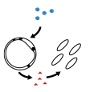

{:style="max-width: 100%; height: auto;"}

# Welcome to the Lind Lab!
{: .display-4}
 
We are part of the [School of Biological Sciences](https://biosciences.gatech.edu/) at [Georgia Tech](https://www.gatech.edu/).
{: .welcomefont}

<!-- {:style="max-width: 100%; height: auto;"} -->

The Lind lab studies microbes that live in the animal gut, focusing on single-celled protists and how they interact with the host. We use computational genomics approaches along with wet-lab microbiology to understand the evolution and ecology of intestinal protists.
{: .welcomefont}

We are located in the Krone Enginereed Biosciences Building.
{: .welcomefont}
